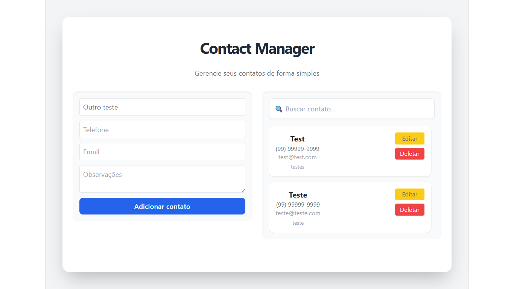

# Contact Manager (Fullstack)

Aplicação web fullstack para gerenciamento de contatos.

##  Status
MVP funcional em evolução

##  Tecnologias

- React (Vite)
- Node.js + Express
- SQLite
- TailwindCSS

##  Funcionalidades

- CRUD de contatos
- Busca por nome
- Validação com Joi
- Máscara de telefone
- Feedback de loading e erro

##  Preview



##  Como rodar

### Backend

```bash
cd backend
npm install
node server.js
```

### Frontend
```bash
cd frontend
npm install
npm run dev
```

### Melhorias futuras

Componentização

Toasts

Dark mode

Deploy

### Autor

Markson Freitas